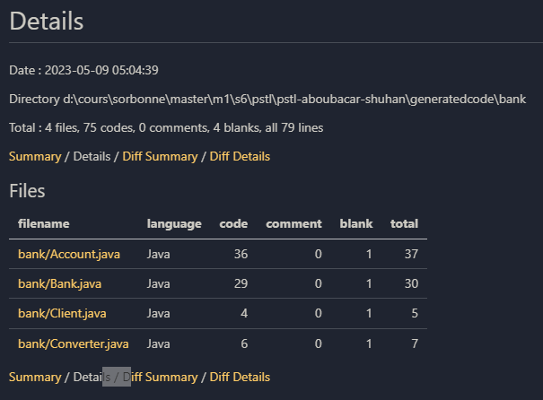
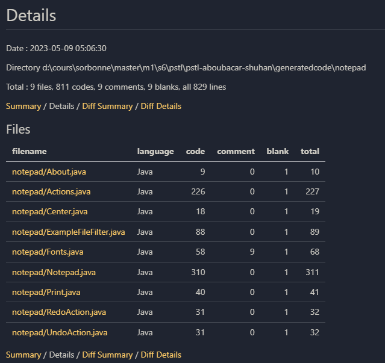

# Projet STL

# Auteurs

Ce repertoire contient le code source de notre 

# Execution

# Experimentation
La class main.Main dans le repetoire src est le point d'entrée du programme. Vous pouvez executer le projet sur chacun des projets suivants:

## Metriques
### Durees (sur une seule execution)
(Refaire pour une moyenne sur plusieurs executions)

| |Duree totale | Duree adaptation | Duree fusion | Duree Identification des blocs | Duree generation de code |
|  :---: |  :---: | :---: | :---: | :---: | :---: |
| Banque  | - (ms) | 720 (ms) | 4 (ms) | 3 (ms) | 20 (ms) |
| Notepad | - (ms) | 1315 (ms) | 11 (ms) | 5 (ms) | 49 (ms) |
| Argouml | - (ms) | 30219 (ms) | 1025 (ms) | 432 (ms) | 30225 (ms) |

### Nombre blocs
| |Nombre de blocs | 
|  :---: |  :---: |
| Banque  | 4 | 
| Notepad | 7 | 
| Argouml | 49 |

### Nombre de lignes de code du code maximal

#### 1. Application banque

#### 2. Application NotePad

#### 3. Argouml

